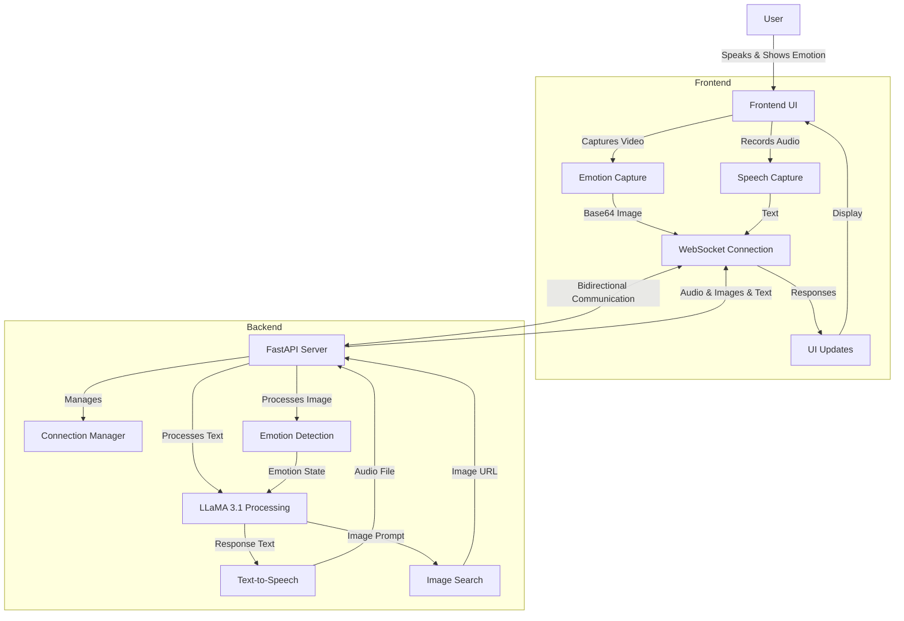

# :icon-mortar-board: AI Teaching Assistant System

   

> [!TIP]
> A multimodal AI assistant system integrating emotion detection, speech processing, and contextual AI responses.

## :icon-goal: Problem Statement
Modern classrooms lack real-time, interactive tools to address diverse student needs and keep them engaged. The objective is to create a multimodal AI assistant that:

- Accepts and processes text and voice queries from students in real-time.
- Provides contextual responses, including textual explanations, charts, and visual aids.
- Detects disengagement or confusion using facial expression analysis.

## :icon-tools: Features

- :icon-smiley: **Emotion Detection**: Detects user's facial emotions in real-time using DeepFace and OpenCV
- :icon-unmute: **Voice-to-Text**: Converts user's speech to text for natural language input
- :icon-hubot: **AI Processing**: Processes user queries with emotion-aware AI responses
- :icon-search: **Image Search**: Finds relevant images based on contextual prompts
- :icon-unmute: **Text-to-Voice**: Converts AI responses to speech with emotion-appropriate voice synthesis
- :icon-device-desktop: **Web Interface**: Modern UI built with HTML, TailwindCSS, and JavaScript

## :icon-stack: System Architecture

### :icon-server: Backend
- FastAPI server with asynchronous WebSocket implementation
- Connection management system handling multiple concurrent users
- Integration of multiple AI components
- Efficient state tracking of user emotions, interactions, and responses
- Asynchronous processing for better performance

### :icon-browser: Frontend
- Responsive design with TailwindCSS
- Real-time WebSocket communication for seamless interactions
- Camera integration for emotion detection
- Dynamic UI updates based on emotion detection
- Speech recognition using Web Speech API

### :icon-workflow: System Flow Diagram



## :icon-desktop-download: Demo

### :icon-image: Screenshots


*Screenshot: Main interface showing the emotion-aware Classroom AI assistant with real-time camera feed and chat interface*

## :icon-play: Usage

1. Click the "Start Assistant" button to begin
2. Allow camera and microphone permissions when prompted
3. Speak clearly to interact with the assistant
4. The system will:
   - Detect your emotion
   - Convert your speech to text
   - Process your query with AI
   - Display relevant images
   - Speak the AI response

## :icon-diff: Components

- **main.py**: FastAPI backend server
- **emotion_processor.py**: Handles facial emotion detection
- **voice_processor.py**: Manages speech-to-text conversion
- **img_and_ai.py**: Handles image search and AI processing
- **TextToVoice.py**: Manages text-to-speech conversion
- **index.html**: Main frontend interface
- **styles.css**: Custom styling
- **app.js**: Frontend JavaScript logic

## :icon-file-directory: Project Structure

```
version1/
├── README.md                     # Project documentation
├── requirements.txt              # Python dependencies
├── server.py                     # Main server entry point
├── .env                          # Environment Variables
├── asset/
│   ├── screenrecord.mp4          # Demo video showing system functionality
│   └── screenshot.jpeg           # Interface screenshot
├── backend/
│   ├── emotion_processor.py      # Emotion detection processing
│   ├── haarcascade_frontalface_default.xml  # Face detection model
│   ├── img_and_ai.py             # Image processing utilities
│   ├── main.py                   # FastAPI application logic
│   ├── TextToVoice.py            # Text-to-speech functionality
│   └── voice_processor.py        # Speech recognition functionality
└── frontend/
    ├── static/
    │   ├── app.js                # Frontend JavaScript
    │   ├── styles.css            # CSS styling
    │   └── final_audio_*.mp3     # Generated audio responses
    └── templates/
        └── index.html            # Main web interface
```

## :icon-ai-model: AI Core & Technical Details

### AI Model
- LLaMA 3.1 3B (8-bit) fine-tuned on 9,000+ emotion-labeled Q&A pairs
- Custom emotion-aware prompt engineering with context preservation
- Dedicated processing pipeline for each detected emotional state
- Local model deployment with optimized inference for responsive interactions

### Emotion Detection
- DeepFace & OpenCV with real-time webcam processing
- Base64 image encoding for efficient WebSocket transmission
- Continuous emotional state tracking with state management

### Voice Interaction
- Speech-to-Text for natural language input
- Edge Text-to-Speech with emotion-appropriate voice synthesis
- Unique audio file generation with UUID-based identification

### Image Search
- Contextual image sourcing driven by prompt
- Dynamic content generation that adapts to both query and detected emotion
- Integrated image processing with AI-generated responses

## :icon-code-square: Implementation Details

This isn't just an API wrapper—it's a complete system with:
- Custom WebSocket architecture handling real-time bidirectional communication
- End-to-end emotion processing pipeline from detection to response generation
- Local model deployment with optimized inference for responsive interactions
- Comprehensive error handling and logging system
- No external LLM APIs were used due to project restrictions—everything runs locally

### Emotional Intelligence Architecture
- Real-time emotion detection feeding continuously into the AI decision matrix
- Calibrated to different emotional states
- Stateful conversation tracking that maintains emotional context
- Adaptive voice characteristics matching the detected emotional state
- Connection Manager tracking user state across multiple sessions

## :icon-database: Resources

### Dataset and Model
- Dataset: [Ques-Ans-with-Emotion](https://huggingface.co/datasets/0xarchit/Ques-Ans-with-Emotion) - 9,000+ emotion-labeled Q&A pairs
- Model: [AI Teaching Assistant](https://huggingface.co/0xarchit/ai_teaching_assistant) - Fine-tuned LLaMA 3.1 3B

## :icon-gear: Setup Instructions

### Prerequisites

- Python 3.8 or higher
- Webcam for emotion detection
- Microphone for voice input
- Internet connection for image search

### Installation

1. Clone the repository or navigate to the project directory

2. Install dependencies:
   ```
   pip install -r requirements.txt
   ```

3. Set up environment variables:
   - Rename `.env.example` to `.env` (or create a new `.env` file)
   - Add your RapidAPI key for image search
   - Configure any other environment variables as needed
   
   Example `.env` file:
   ```
   RAPIDAPI_KEY="your_rapidapi_key_here"
   RAPIDAPI_HOST="real-time-image-search.p.rapidapi.com"
   AI_MODEL_URL="http://localhost:12345/v1/chat/completions"
   ```

4. Run the server:
   ```
   python server.py
   ```

5. Open your browser and navigate to:
   ```
   http://localhost:8000
   ```


## :icon-bug: Troubleshooting

- If the camera doesn't work, check browser permissions
- If speech recognition fails, ensure your microphone is working
- If the server fails to start, check if port 8000 is available

## :icon-light-bulb: Future Goals

As we continue to develop this AI Classroom Teaching Assistant System, we plan to implement several enhancements to make the experience even more immersive and effective:

### Near-Term Enhancements
- **Emotion-Adaptive Voice Generation**: Integration of a specialized ML model for human-like voice generation that dynamically adapts tone, pitch, and speaking style based on detected student emotions
- **AI Image Generation**: Implementation of diffusion models to create custom educational illustrations and diagrams in real-time based on the educational content being discussed
- **Multi-Student Emotion Tracking**: Ability to simultaneously track and respond to multiple students emotional states in classroom settings
- **Personalized Learning Paths**: Development of student profiles that track engagement patterns and learning preferences to customize future interactions
- **Extended Language Support**: Integration of multilingual capabilities for global classroom deployment

### Long-Term Vision
- **AR/VR Integration**: Creation of immersive educational experiences with 3D visualizations of complex concepts
- **Collaborative Learning Features**: Facilitation of group activities and peer-to-peer learning with AI moderation
- **Advanced Analytics Dashboard**: Comprehensive insights for educators about student engagement, emotional patterns, and learning progress

## :icon-law: License

This project is part of the Intel Unnati program, completed by team Bitbots.
