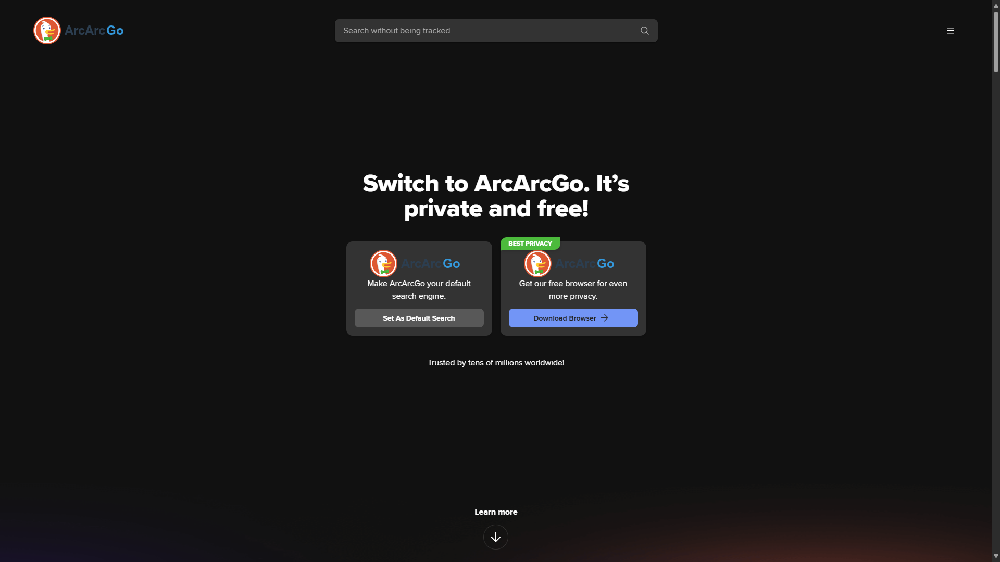
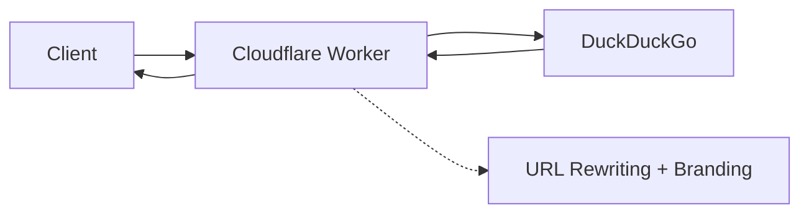

# :icon-globe: ArcArcGo: DuckDuckGo Proxy with Custom Branding

       
   {target="_blank"}

:icon-mark-github: **GitHub**: [0xarchit/ArcArcGo](https://github.com/0xarchit/ArcArcGo){target="_blank"}  
:icon-globe: **Live Demo**: [https://arcarcgo.0xarchit.is-a.dev](https://arcarcgo.0xarchit.is-a.dev/){target="_blank"}

> [!TIP]
> ArcArcGo is a Cloudflare Worker that acts as a transparent proxy for DuckDuckGo, implementing custom branding and URL rewriting through regex patterns and JavaScript injection.

## :icon-device-desktop: Screenshot

## :icon-info: Overview

ArcArcGo demonstrates advanced Cloudflare Workers capabilities by intercepting requests, fetching content from DuckDuckGo, and modifying responses before serving them to clients with custom branding and functionality.

---

## :icon-workflow: Architecture

### Request Flow
1. **Client Request** → Cloudflare Worker
2. **Worker Processing** → DuckDuckGo Server
3. **Response Modification** → Client

---

## :icon-tools: Core Components

### :icon-play: 1. Event Listener
The worker uses a fetch event listener to intercept all incoming HTTP requests and delegates processing to the main `handleRequest` function.

### :icon-gear: 2. Request Handler (`handleRequest`)

#### :icon-link: URL Construction
The worker extracts the pathname, search parameters, and hash from incoming requests and constructs the target DuckDuckGo URL while maintaining the original query structure.

#### :icon-package: Header Processing
**Header Modifications:**
- **Removed:** `Host`, `X-Forwarded-For` (prevents detection as proxy)
- **Set:** Standard browser `Accept` header
- **Set:** Default `User-Agent` if not present

#### :icon-sync: Response Processing
**Response Header Modifications:**
- **Removed:** `Content-Security-Policy` (allows script injection)
- **Added:** CORS header for cross-origin access

### :icon-file-code: 3. Content Type Handling

#### :icon-image: Non-HTML Content
Images, CSS, JavaScript, and other assets are passed through unchanged, maintaining original response body and headers.

#### :icon-code: HTML Content Processing
Uses `TransformStream` for real-time content modification without buffering the entire response.

---

## :icon-link-external: URL Rewriting System

### :icon-search: Pattern Matching
The worker uses comprehensive regex patterns to identify and rewrite URLs, including:
- **Standard HTML attributes:** `href`, `src`, `action` in both double and single quotes
- **CSS URLs:** `url()` declarations
- **Meta refresh:** URL redirects in meta tags
- **JavaScript redirects:** `window.location`, `location.href`, etc.
- **Data attributes:** Custom data URLs for navigation
- **Absolute paths:** Standalone paths in quotes
- **Event handlers:** `onclick`, `onchange`, `onsubmit` attributes

### :icon-arrow-switch: URL Transformation Logic

#### :icon-globe: 1. Absolute URLs
Only processes DuckDuckGo URLs by stripping the domain and prepending the proxy base URL.

#### :icon-file-directory: 2. Relative URLs
Resolves relative URLs against the DuckDuckGo origin while maintaining query parameters.

#### :icon-alert: 3. Special Cases
- **Fragments (#):** Preserved unchanged
- **Data URLs:** Preserved unchanged  
- **JavaScript URLs:** Preserved unchanged
- **Event Handlers:** Special processing for location changes

---

## :icon-paintbrush: Branding System

### :icon-pencil: Text Replacement
Real-time text replacement in HTML content using regex patterns to replace "DuckDuckGo" with "ArcArcGo" and handle possessive forms.

### :icon-image: Logo Replacement
Regex-based logo replacement that identifies DuckDuckGo logo images and replaces them with the custom ArcArcGo logo.

### :icon-code: JavaScript Injection
Dynamic branding through injected script that:
- **Text Replacement:** Uses TreeWalker to traverse all text nodes
- **Title Replacement:** Updates document title
- **Logo Replacement:** Targets specific CSS selectors for logo images
- **Dynamic Monitoring:** Uses MutationObserver for continuously added content
- **Multiple Triggers:** Responds to load, DOMContentLoaded events, and periodic intervals

---

## :icon-workflow: Stream Processing

### :icon-package: Chunked Processing
The worker processes content in chunks to optimize memory usage and provide real-time response modification. It uses a buffer system with:

**Buffer Management:**
- **Size Threshold:** 8192 bytes
- **Content Threshold:** Presence of `</body>` tag
- **Final Processing:** Script injection before response completion

---

## :icon-alert: Error Handling

The worker implements comprehensive error handling for:
- Network connectivity issues
- Invalid URL construction
- Stream processing errors
- Regex processing failures

All errors return a 500 status response with a descriptive error message.

---

## :icon-zap: Performance Considerations

### :icon-rocket: Optimization Strategies
1. **Selective Processing:** Only HTML content is modified
2. **Chunked Streaming:** Real-time processing without buffering entire response
3. **Efficient Regex:** Compiled patterns for fast matching
4. **Header Optimization:** Minimal header modifications

### :icon-graph: Resource Usage
- **Memory:** Stream-based processing minimizes memory usage
- **CPU:** Regex operations on text chunks
- **Network:** Direct proxy with minimal latency

---

## :icon-shield: Security Considerations

### :icon-check: Mitigations Implemented
1. **CSP Removal:** Enables script injection
2. **Header Sanitization:** Removes tracking headers
3. **URL Validation:** Prevents open proxy attacks
4. **Content Filtering:** Only processes specific content types

### :icon-alert: Potential Risks
- **Open Proxy:** Limited to DuckDuckGo domain
- **Script Injection:** Controlled injection for branding only
- **Privacy:** No logging or data collection

---

## :icon-rocket: Deployment Guide

### :icon-checklist: Prerequisites
- Cloudflare account
- Workers subscription (free tier available)

### :icon-upload: Deployment Steps
1. **Create Worker:** In Cloudflare dashboard
2. **Deploy Code:** Copy `worker.js` content
3. **Configure Routes:** Set custom domain or use workers.dev subdomain
4. **Test Functionality:** Verify search and branding

### :icon-gear: Configuration Options
- **Custom Logo:** Modify `newLogoSrc` variable
- **Branding Text:** Adjust replacement patterns
- **Target Domain:** Change `targetHost` for different proxy targets

---

## :icon-tools: Troubleshooting

### :icon-bug: Common Issues

#### :icon-code: 1. Script Injection Not Working
- **Cause:** CSP blocking or timing issues
- **Solution:** Verify CSP removal, check MutationObserver

#### :icon-link: 2. URLs Not Rewriting
- **Cause:** Pattern mismatch or encoding issues
- **Solution:** Test regex patterns, check URL encoding

#### :icon-zap: 3. Performance Issues
- **Cause:** Large content or complex patterns
- **Solution:** Optimize buffer size, simplify regex patterns

### :icon-bug: Debug Techniques
1. **Console Logging:** Add logging to worker (remove in production)
2. **Network Inspection:** Check headers and response codes
3. **Content Validation:** Verify HTML modifications

---

## :icon-stop: Limitations

### :icon-cpu: Technical Limitations
- **JavaScript-Heavy Sites:** May require additional pattern matching
- **Dynamic Content:** MutationObserver helps but may miss rapid changes
- **Complex URLs:** Some edge cases may not be covered

### :icon-law: Legal Considerations
- **Terms of Service:** May violate target site's ToS
- **Copyright:** Logo and content modifications
- **Educational Use:** Intended for learning purposes only

---

> [!WARNING]
> **Important Notice**: This is not a clone or phishing page. This is an educational project created while exploring Cloudflare Workers and can be treated as a prototype for creating similar website proxies. It will be removed if it violates any ToS or is found to be illegal.
>
> **Contact**: mail@0xarchit.is-a.dev

---

## :icon-trophy: Conclusion

ArcArcGo demonstrates advanced Cloudflare Workers capabilities including:

+++ :icon-gear: Technical Features
- Real-time content transformation
- Complex regex-based URL rewriting  
- Dynamic JavaScript injection
- Stream processing optimization
+++ :icon-rocket: Implementation Highlights
- Practical proxy server development
- Performance optimization techniques
- Maintaining functionality of underlying service
- Educational exploration of web proxy concepts
+++

The implementation showcases how modern edge computing can be used to create sophisticated web proxies while maintaining the performance and functionality of the underlying service.
