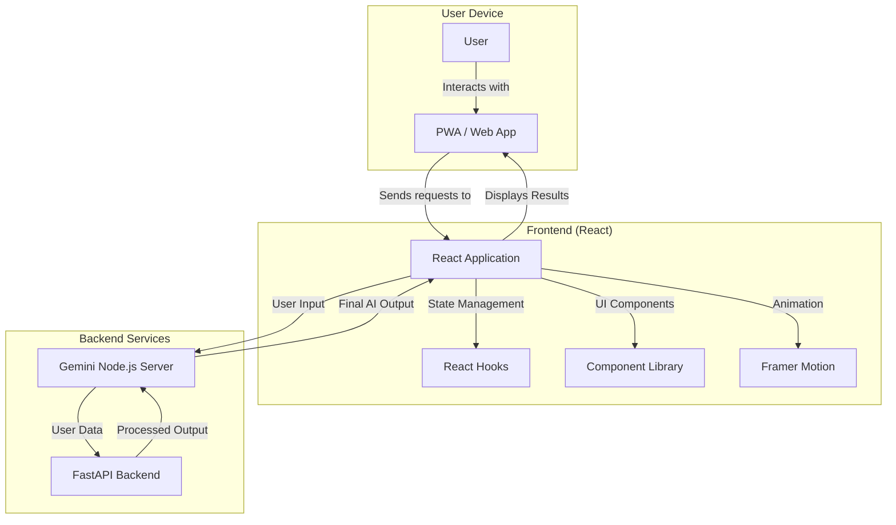
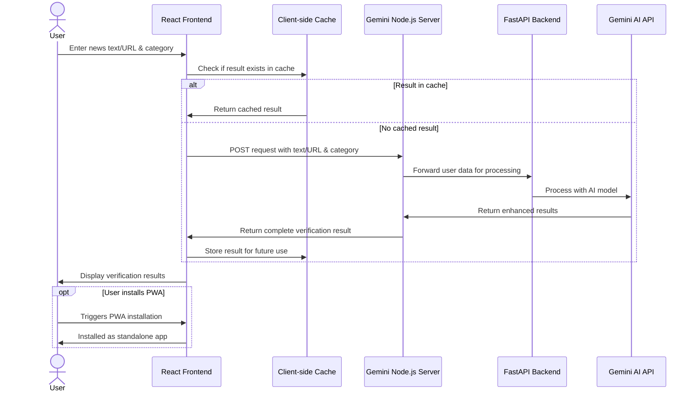
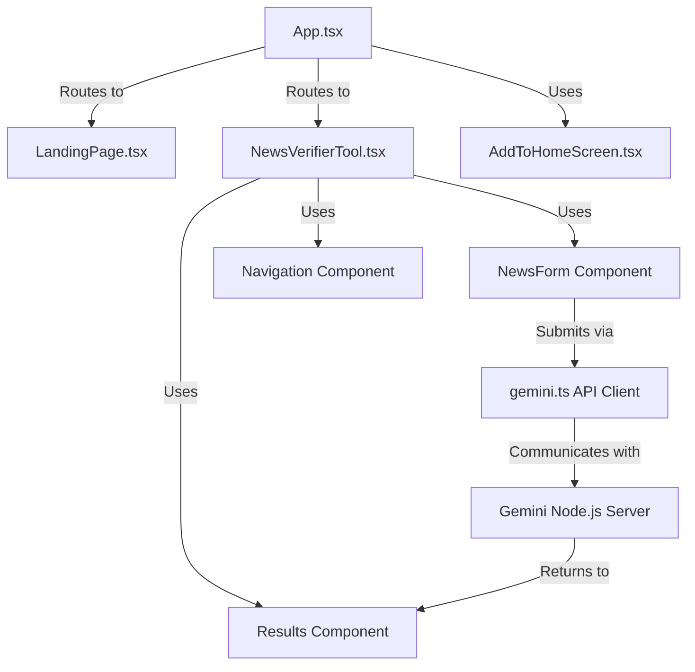

# Fake News Detector

## Overview

The Fake News Detector is a web application that leverages AI to verify the authenticity of news articles. It provides users with a trust score, analysis, potential biases, and recommendations based on the submitted news content or URL.

## Architecture

The project follows a modern frontend-centric architecture:

1. **Frontend**: React application built with TypeScript and served as a Progressive Web App (PWA)
2. **API Integration**: Connects to a Gemini-powered API service for news verification



### Complete Workflow Diagram

The following diagram illustrates the complete flow of a news verification request from user input to displaying results:



## Frontend Implementation

The frontend is a Progressive Web Application (PWA) built with React, TypeScript, and Tailwind CSS. It provides a responsive interface for users to interact with the news verification system.

### Key Components



### Main Pages

1. **Landing Page**: Marketing-focused page introducing the application with animated sections
2. **Tool Page**: The functional page where users can submit news for verification

### Features

- **Progressive Web App**: Can be installed on mobile and desktop devices
- **Responsive Design**: Works across all screen sizes
- **Caching System**: Stores previous verification results to minimize duplicate API calls
- **Modern UI**: Animated components using Framer Motion
- **Input Flexibility**: Accepts both text input and URLs for news verification
- **Category-Based Analysis**: Customizes verification based on news category

## Component Breakdown

### NewsVerifierTool
This is the main functional component that allows users to verify news. It manages:
- Form state for news input
- API communication
- Results display
- Error handling
- Loading states
- Cache management for previously verified content

### NewsForm
Handles user input for:
- Text or URL input toggle
- News content submission
- Category selection
- Form validation

### Results
Displays verification results including:
- Trust score with color coding
- Detailed analysis
- Source verification with clickable links
- Potential biases
- Recommendations

### Navigation
Responsive navigation component that:
- Adapts to scroll position
- Shows different styling based on current route
- Collapses to a mobile menu on smaller screens

### AddToHomeScreen
PWA installation component with:
- Button variant for landing page
- Modal variant for prompting installation
- Handles installation events and user responses

## Backend Endpoints and Working

### Node.js Gemini API Server

- **POST `/api/verify-news`**  
  Accepts:  
  ```json
  {
    "text": "news text or url",
    "category": "category string"
  }
  ```
  
  Returns:  
  ```json
  {
    "trustScore": 85,
    "analysis": "This news article appears to be authentic based on cross-referencing with reliable sources.",
    "sourceandrelated": "Verified against sources: https://example.com/news1, https://example.com/news2. The article correctly reports on the key facts of the event.",
    "potentialBiases": ["Slight political leaning in terminology", "Emphasis on certain stakeholders"],
    "recommendation": "The article can be considered reliable, though readers should be aware of the slight bias in presentation."
  }
  ```
  - Forwards the request to the FastAPI backend to fetch recent news context.
  - Uses Gemini AI to analyze the user input against the fetched news context and category.
  - Returns a JSON object with fields: `trustScore`, `analysis`, `sourceandrelated`, `potentialBiases`, `recommendation`.

- **GET `/api/health`**  
  Returns health and environment status of the Node.js server.

#### How it works:
1. Receives user news and category.
2. Calls FastAPI backend to get recent news context.
3. Constructs a prompt for Gemini AI including user input and context.
4. Parses Gemini's JSON response and returns it to the frontend.

---

### FastAPI News Context Backend

- **POST `/api/analyze`**  
  Accepts:  
  ```json
  {
    "news_text": "news text or url",
    "category": "category string"
  }
  ```
  
  Returns:  
  ```json
  {
    "results": [
      {
        "headline": "Example News Headline",
        "description": "Brief description of the news article content...",
        "source_link": "https://example.com/news-article",
        "date": "2023-06-15"
      },
      {
        "headline": "Another Related News Article",
        "description": "Description of another related article...",
        "source_link": "https://example.org/related-news",
        "date": "2023-06-14"
      }
      // Additional results...
    ]
  }
  ```
  - Searches DuckDuckGo for recent news links related to the input and category.
  - Fetches and parses up to 4 news articles for headline, description, source link, and date.
  - Returns a list of news context objects.

- **GET `/health`**  
  Returns a simple health check JSON.

- **GET `/docs`**  
  Auto-generated interactive API documentation (Swagger UI) provided by FastAPI.  
  Allows you to explore and test all available endpoints directly from the browser.

#### How it works:
1. Receives news text and category.
2. Performs a DuckDuckGo search for relevant news.
3. Fetches and parses metadata from top results.
4. Returns structured news context for use by the Gemini server.

---

**Integration Flow:**
- The frontend calls the Node.js `/api/verify-news` endpoint.
- Node.js server fetches news context from FastAPI `/api/analyze`.
- Node.js server uses Gemini AI to verify and analyze the news.
- The result is returned to the frontend for display.

---

## Implementation Details

### Caching Implementation
```typescript
// Global cache persists between route changes
const globalNewsDataCache: { [key: string]: any } = {};

function App() {
  // Use a ref to maintain reference to the global cache
  const newsDataCacheRef = useRef<{ [key: string]: any }>(globalNewsDataCache);
  
  // ...rendering logic
}
```

### API Integration
```typescript
export async function verifyNews(source: string, category: string) {
  const apiUrl = import.meta.env.VITE_GEMINIAPIURL;

  const response = await fetch(apiUrl, {
    method: "POST",
    headers: { "Content-Type": "application/json" },
    body: JSON.stringify({ text: source, category }),
  });

  if (!response.ok) {
    throw new Error(`Failed to verify news: ${response.statusText}`);
  }

  return await response.json();
}
```

### Response Schema

```typescript
interface VerificationResult {
  trustScore: number;      // 0-100 percentage
  analysis: string;        // Detailed text analysis
  sourceandrelated: string; // Source URLs and additional context
  potentialBiases: string[]; // List of identified biases
  recommendation: string;   // Actionable recommendation
}
```

## Tech Stack

### Frontend
- **React**: UI library for building component-based interfaces
- **TypeScript**: For type safety and improved developer experience
- **Tailwind CSS**: For utility-first styling
- **Framer Motion**: For sophisticated animations and transitions
- **React Router**: For client-side routing
- **Vite**: Fast build tool and development server
- **PWA**: Service workers and manifest for installable web app functionality

### Tools & Infrastructure
- **ESLint**: Code quality and consistency
- **PostCSS**: CSS processing with plugins
- **Cloudflare Pages/Vercel**: Potential deployment platforms

## PWA Implementation

The project is configured as a Progressive Web App using the `vite-plugin-pwa` plugin:

```typescript
VitePWA({
  registerType: "autoUpdate",
  manifest: {
    name: "News Verifier",
    short_name: "NewsCheck",
    start_url: "/",
    display: "standalone",
    background_color: "#ffffff",
    theme_color: "#000000",
    icons: [{ src: "/image.png", sizes: "192x192", type: "image/png" }],
  },
  workbox: {
    globPatterns: ["**/*.{js,css,ico,png,svg}"],
    navigateFallback: "index.html",
    navigateFallbackDenylist: [/^\/api/],
  },
})
```

## Installation and Local Development

### Prerequisites

- Node.js 16+
- npm or yarn

### Setup

```bash
# Clone the repository
git clone https://github.com/yourusername/fake-news-detector.git

# Navigate to the project directory
cd fake-news-detector

# Install dependencies
npm install

# Create .env file with required variables
echo "VITE_GEMINIAPIURL=https://your-api-endpoint.com/verify" > .env

# Run the development server
npm run dev
```

### Environment Variables

#### Required Variables
```
VITE_GEMINIAPIURL=https://your-api-endpoint.com/verify
```

## Usage Guide

### Basic Usage

1. **Visit the Website**: Go to the deployed application
2. **Select Input Type**: Choose between text input or URL
3. **Enter News Content**: Paste the news article or URL
4. **Select Category**: Choose the relevant news category from education, politics, finance, etc.
5. **Submit**: Click "Verify News"
6. **Review Results**: Examine the trust score, analysis, and recommendations

### Installing as PWA

1. Visit the website in a compatible browser (Chrome, Edge, Safari, etc.)
2. Look for the "Install App" button or the installation prompt
3. Add the app to your home screen
4. Access the app directly from your device's home screen or app drawer

## Project Structure

```
fake-news-detector/
├── src/                    # Frontend source code
│   ├── components/         # React components
│   │   ├── Navigation.tsx  # Navigation bar component
│   │   ├── NewsForm.tsx    # News submission form
│   │   └── Results.tsx     # Results display component
│   ├── lib/                # Utility functions
│   │   └── gemini.ts       # API integration for news verification
│   ├── App.tsx             # Main app component with routing
│   ├── LandingPage.tsx     # Marketing landing page
│   ├── NewsVerifierTool.tsx # Main news verification tool
│   └── AddToHomeScreen.tsx # PWA installation component
├── public/                 # Static assets and PWA resources
│   ├── _redirects          # SPA redirect configuration
│   ├── manifest.json       # PWA manifest
│   └── image.png           # App icon
├── vite.config.ts          # Vite & PWA configuration
├── tailwind.config.js      # Tailwind CSS configuration
├── tsconfig.json           # TypeScript configuration
└── package.json            # Project dependencies
```

## Development Guidelines

### Code Style

- Use TypeScript for type safety
- Follow functional React patterns with hooks
- Implement responsive design for all screen sizes
- Use semantic HTML elements for better accessibility
- Follow the project's ESLint configuration

### Project Structure

- Keep components focused on a single responsibility
- Use custom hooks for shared logic
- Implement proper error handling throughout the application
- Document complex logic with comments
- Use consistent naming conventions

## Performance Optimizations

- **PWA Caching**: Critical assets are cached for offline use
- **Client-side Caching**: Previous verification results are stored to minimize API calls
- **Lazy Loading**: Components and routes could be lazy-loaded for faster initial load
- **Animations**: Optimized with hardware acceleration where possible
- **Build Optimization**: Production builds are optimized for size and performance

## Security Considerations

- API keys are stored securely in environment variables
- Input validation on user-submitted content
- HTTPS is required for PWA functionality
- Cross-site request security headers

## Future Enhancements

1. **User Accounts**: Allow users to save verification history and preferences
2. **Browser Extensions**: Create browser extensions for verifying news directly on news websites
3. **Multiple Languages**: Support verification in different languages
4. **Explanation Features**: Add more detailed explanations of verification methods
5. **Historical Context**: Provide historical context for news topics to improve verification accuracy
6. **Citation Verification**: Verify citations and references within news articles

## Troubleshooting

### Common Issues

1. **API Connection Errors**: Check your internet connection and API endpoint configuration
2. **Installation Issues**: Make sure your browser supports PWA installation and you're using HTTPS
3. **Rendering Problems**: Clear browser cache if you encounter UI display issues
4. **Form Submission Errors**: Ensure all required fields are completed before submission

## Contact

For questions or assistance, please contact:
- GitHub: [0xarchit](https://github.com/0xarchit)

## License

This project is licensed under the MIT License - see the LICENSE file for details.
