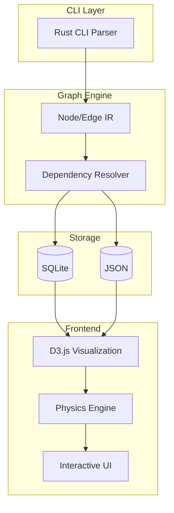

# Grafyx

    
    [](https://grafyx.0xarchit.is-a.dev){target="_blank"}

:icon-mark-github: **GitHub:** [0xarchit/grafyx](https://github.com/0xarchit/grafyx){target="_blank"}  
:icon-globe: **Live Demo:** [https://grafyx.0xarchit.is-a.dev](https://grafyx.0xarchit.is-a.dev){target="_blank"}

> [!TIP]
> Visualize Your Codebase Like Never Before. A high-performance CLI-driven code knowledge graph tool.

> [!NOTE]
> This project is in Beta and may have bugs.

## :icon-milestone: Overview

**Grafyx** is a high-performance, CLI-driven code knowledge graph tool designed to map and visualize the complex relationships within modern codebases. By parsing directory structures and service interactions, Grafyx generates an interactive 2D/3D force-directed graph that helps developers understand dependency chains, structural bottlenecks, and project architecture at a glance.

Developed with **Rust** for safety and speed, and **D3.js** for fluid frontend interactions, Grafyx bridges the gap between static analysis and intuitive visual exploration.

## :icon-image: Visual Demo


## :icon-stack: Architecture

Grafyx follows a decoupled architecture, ensuring high-speed processing and a responsive user experience.

### System Flow Diagram



## :icon-tools: Features

| Feature | Description | Status |
|---------|-------------|--------|
| :icon-file-directory: **Recursive Scanning** | Scans entire projects to map file/directory hierarchies | ✔ Active |
| :icon-zap: **Hot Physics** | Real-time adjustable simulation forces with sub-millisecond response | ✔ Active |
| :icon-package: **Static Binaries** | Universal Linux binaries (MUSL) optimized for Arch and Ubuntu | ✔ Active |
| :icon-gear: **Self-Managing** | Integrated `install` and `upgrade` commands for zero-friction setup | ✔ Active |
| :icon-device-desktop: **Apple Silicon Native** | Native performance for M1/M2/M3 architecture via ARM64 targets | ✔ Active |
| :icon-database: **Dual Storage** | Outputs both human-readable JSON and performance-optimized SQLite | ✔ Active |

## :icon-sync: Live Physics Engine

Grafyx features a "Hot Update" physics engine inspired by tools like Obsidian. Adjusting sliders instantly ripples through the graph without requiring a full re-render, keeping the simulation fluid and "liquid."

### Force Parameters

- :icon-arrow-both: **Repulsion**: Determines how much nodes push away from each other
- :icon-link: **Link Distance**: Controls the target length for edges
- :icon-circle: **Gravity (Center Force)**: Pulls all nodes toward the center point
- :icon-stop: **Damping**: Adjusts the decay rate of movement for stability

## :icon-gear: Getting Started

### Installation

#### Binary Install (Recommended)

**Linux (AMD64)**:
```bash
curl -L https://github.com/0xarchit/grafyx/releases/latest/download/grafyx-linux-amd64-static -o grafyx && chmod +x grafyx && ./grafyx install && rm grafyx
```

**macOS (Apple Silicon)**:
```bash
curl -L https://github.com/0xarchit/grafyx/releases/latest/download/grafyx-macos-aarch64 -o grafyx && chmod +x grafyx && ./grafyx install && rm grafyx
```

**macOS (Intel)**:
```bash
curl -L https://github.com/0xarchit/grafyx/releases/latest/download/grafyx-macos-x86_64 -o grafyx && chmod +x grafyx && ./grafyx install && rm grafyx
```

**Windows (PowerShell)**:
```powershell
iwr https://github.com/0xarchit/grafyx/releases/latest/download/grafyx-windows-amd64.exe -OutFile grafyx.exe; .\grafyx install; del grafyx.exe
```

#### Build from Source

```bash
git clone https://github.com/0xarchit/grafyx.git
cd grafyx/tool
cargo build --release
```

## :icon-play: Quick Start

If this is your first time using Grafyx, run the command below from your project root.

### Scan Command

```bash
grafyx --dirs <directories space separated> --output ./<output folder>
```

**Example**:
```bash
grafyx --dirs tool web --output ./output-test
```

After scan completes:
- Open `./<output folder>/index.html` in your browser
- Use `grafyx.json` for readable data export
- Use `grafyx.db` for fast programmatic queries

## :icon-terminal: Usage

### Commands

| Command | Alias | Description |
|---------|-------|-------------|
| `grafyx --dirs <directories...> --output ./<output-folder>` | - | Scan directories and generate graph |
| `grafyx install` | `i` | Install binary permanently to system PATH |
| `grafyx upgrade` | `u` | Automatically update to latest version |
| `grafyx uninstall` | - | Cleanly removes Grafyx from your system |
| `grafyx --version` | - | Display current version |

### Scan Flags

| Flag | Description |
|------|-------------|
| `--dirs` | One or more directories to scan, space separated |
| `--output` | Output folder for `grafyx.json`, `grafyx.db`, and `index.html` |
| `--format` | Output type: `json`, `sqlite`, or `both` (default) |
| `--ignore` | Optional ignore patterns to exclude files/directories |

## :icon-file-directory: Configuration

Settings are persisted in the browser's `localStorage` under `grafyx-settings`. This allows you to maintain your custom visual configuration across different scans of the same project.

- **Theme**: Fixed dark mode for maximum contrast
- **Node Colors**: Scaled based on connectivity or type (Service/Import vs. Structural)
- **Link Colors**: 
  - **Vibrant Green**: Service dependencies/imports
  - **White**: Structural hierarchy

## :icon-heart: Attribution

Grafyx is created and maintained by **0xArchit**.

If you build on top of this project, please provide proper attribution. Any derivative works must retain the original copyright notice in the license.
