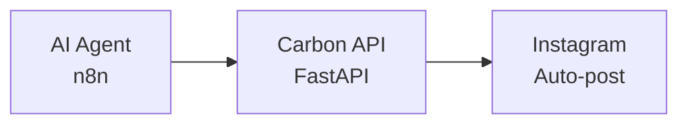
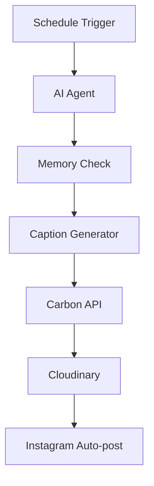

# :icon-hubot: Automated Meme Generation System

       
  

:icon-mark-github: **Github**: [0xarchit/carbon-now-sh-api](https://github.com/0xarchit/carbon-now-sh-api){target="_blank"}  
:icon-globe: **Github**: [0xarchit/n8n-templates](https://github.com/0xarchit/n8n-templates/tree/main/Instagram%20auto%20meme%20post){target="_blank"}

> [!TIP]
> A complete AI-powered automation system that generates programming memes and posts them to Instagram automatically using n8n workflows and a custom Carbon.now.sh API.

## :icon-workflow: Architecture



---


## :icon-tools: Components

### :icon-hubot: 1. AI Agent (n8n Workflow)
- **Purpose**: Automated meme generation and Instagram posting
- **Stack**: n8n + Mistral LLM + Memory + Scheduling
- **Features**:
  - Scheduled meme generation (customizable intervals)
  - Sarcastic programming humor using Mistral AI
  - Persistent memory to avoid repetition
  - Automated Instagram posting via FB Graph API
  - Cloudinary integration for image hosting

### :icon-image: 2. Carbon API (FastAPI Service)
- **Purpose**: Convert code snippets to beautiful images
- **Stack**: FastAPI + Playwright + Carbon.now.sh
- **Features**:\
  - Pre-configured Seti theme with Hack font
  - No watermarks or distractions
  - Docker containerized
  - CORS enabled

---

## :icon-rocket: Quick Start

### :icon-container: Carbon API
```bash
cd carbon-api
docker build -t carbon-api .
docker run -p 8000:8000 carbon-api
```

### :icon-workflow: AI Agent Setup
1. Import `ai-agent/instagram_autopost.json` into your n8n instance
2. Configure credentials:
   - Mistral Cloud API
   - Facebook Graph API (Instagram)
   - Cloudinary (optional)
3. Update URLs to point to your Carbon API deployment
4. Set schedule trigger as needed

---

## :icon-globe: Live Demo

:icon-rocket: **Carbon API**: [https://zeroxcarbon.onrender.com/docs](https://zeroxcarbon.onrender.com/docs){target="_blank"}

:icon-rocket: **Instagram**: [https://www.instagram.com/echosarcasm](https://www.instagram.com/echosarcasm){target="_blank"}

---

## :icon-checklist: Prerequisites

+++ :icon-image: For Carbon API
- Docker or Python 3.11+
- Playwright (auto-installed)
+++ :icon-hubot: For AI Agent
- n8n instance (self-hosted or cloud)
- Mistral Cloud account
- Facebook Developer account (Instagram Basic Display)
- Cloudinary account (optional)
+++

---

## :icon-gear: Configuration

### :icon-workflow: AI Agent Workflow
1. **Schedule Trigger**: Set your posting frequency
2. **Mistral LLM**: Configure API credentials
3. **Carbon API URL**: Point to your deployed Carbon service
4. **Instagram**: Configure FB Graph API credentials
5. **Memory**: Maintains context to avoid duplicate memes

### :icon-image: Carbon API
- **Theme**: Seti (dark)
- **Font**: Hack 12px
- **Output**: JPG at 90% quality
- **No line numbers or window controls**

---

## :icon-workflow: Workflow Process



1. **Schedule Trigger** → Starts the automation
2. **AI Agent** → Generates witty programming meme
3. **Memory Check** → Ensures uniqueness
4. **Caption Generator** → Creates Instagram-ready text
5. **Carbon API** → Converts code to beautiful image
6. **Cloudinary** → Uploads image (optional)
7. **Instagram** → Auto-posts to your account

---

## :icon-sliders: Customization

+++ :icon-paintbrush: Content Customization
- **Meme Style**: Edit prompts in AI Agent nodes
- **Visual Theme**: Modify Carbon API parameters
+++ :icon-clock: Scheduling & Platforms
- **Posting Schedule**: Adjust Schedule Trigger intervals
- **Platforms**: Extend to Twitter, LinkedIn, etc.
+++

---