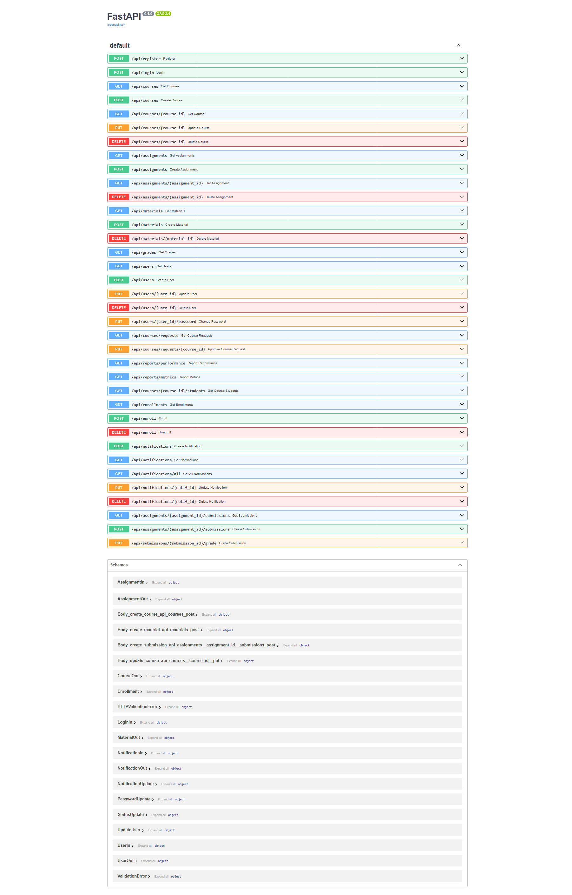

# LearnTrack


:icon-mark-github: **GitHub**: [0xarchit/LearnTrack](https://github.com/0xarchit/LearnTrack){target="_blank"}

> [!NOTE] 
> LearnTrack is a comprehensive learning management system designed for educational institutions with role-based access for students, faculty, and administrators.
> As this project was built using SQLite with basic encryption for a short-duration college project, it has some security vulnerabilities. I plan to improve the security features in future updates.

## :icon-globe: Live Demo

- **Frontend**: [https://learntrack.pages.dev](https://learntrack.pages.dev){target="_blank"} - deployed on Cloudflare Pages
- **Backend**: deployed using Docker on Render

## :icon-device-desktop: Screenshots

+++ Landing Page

+++ Panels


+++ API Interface

+++

## :icon-goal: Problem Statement

!!! :icon-book: Project Brief
Learn Track streamlines course access, submission tracking, and academic progress for students and faculty. It supports resource uploading, grading, feedback, and certificate downloads. Personalized dashboards give real-time academic analytics. The system supports semester-based enrollment, auto-notifications, and bulk result uploads.
!!!

### :icon-people: User Responsibilities

| **Student**                                    | **Faculty**                                      | **Admin**                                      |
|-----------------------------------------------|-----------------------------------------------|-----------------------------------------------|
| Enroll in courses and view syllabus | Upload lecture content                        | Approve new course creation                  |
| Submit assignments and check grades           | Grade submissions and provide remarks        | Manage user permissions                      |
| Access study material and feedback            | Track student performance                    | Generate result analysis and performance reports |


### :icon-tools: Allowed Tools
- **Frontend:** React, framer-motion, Tailwind CSS, etc.
- **Backend:** Python (FastAPI) with SQLite3


## :icon-note: Overview

LearnTrack is a comprehensive learning management system that streamlines course access, submission tracking, and academic progress for students and faculty. It provides a robust platform with personalized dashboards offering real-time analytics and supports semester-based enrollment, auto-notifications, and bulk result uploads.

## :icon-rocket: Features

+++ Core Features
* :icon-shield-lock: **Role-based Access** - Student, faculty, and admin portals
* :icon-book: **Course Management** - CRUD operations and enrollment tracking
* :icon-file: **Assignment System** - Creation, submission, and grading workflow
* :icon-upload: **File Management** - Materials and submissions handling
* :icon-bell: **Real-time Notifications** - Role-targeted messaging system
+++ Dashboard Tools
* :icon-graph: **Analytics** - Performance metrics and progress tracking
* :icon-report: **Reporting** - Customized reports for different stakeholders
* :icon-calendar: **Scheduling** - Course timeline and assignment due dates
+++ User Experience
* :icon-paintbrush: **Theming** - Dark/light theme support
* :icon-device-mobile: **Responsive Design** - Mobile-friendly interface
* :icon-accessibility: **Accessibility** - WCAG-compliant components
+++

## :icon-stack: Tech Stack

| :icon-browser: **Frontend**                    | :icon-server: **Backend**                    | :icon-lock: **Authentication**              |
|-----------------------------------------------|---------------------------------------------|--------------------------------------------|
| React - UI library for building component-based interfaces | FastAPI - Modern, high-performance Python web framework | Role-based Access Control - Permission management  |
| TypeScript - For type safety and improved developer experience | SQLite - Lightweight relational database  | Bcrypt - Password hashing                 |
| Framer Motion - For sophisticated animations and transitions | Pydantic - Data validation and settings management |  |
| Tailwind CSS - For utility-first styling      | Uvicorn - ASGI server implementation       |                                            |
| React Router - For client-side routing       |                                           |                                            |


## :icon-file-directory: Folder Structure

```text
LearnTrack/
├── backend/            # FastAPI server
│   ├── app.py          # Main application entry
│   ├── models/         # Database models
│   ├── routers/        # API route handlers
│   ├── services/       # Business logic layer
│   ├── utils/          # Helper functions
│   └── uploads/        # File storage
├── public/             # Static assets
├── src/                # React application
│   ├── components/     # UI & dashboards
│   ├── contexts/       # Auth, Theme, Notifications
│   ├── layouts/        # Auth & Main layouts
│   ├── pages/          # Route-based pages
│   └── App.tsx         # Routes configuration
├── database.db         # SQLite database
├── package.json        # Frontend dependencies
└── README.md           # Project documentation
```  

## :icon-play: Getting Started

### :icon-package: Prerequisites

- Node.js >= 18
- pnpm or npm
- Python 3.9+
- pip

### :icon-desktop-download: Installation

```bash
# Frontend setup
cd LearnTrack
pnpm install

# Backend setup
cd backend
pip install -r requirements.txt
```

### :icon-container: Prebuilt Docker Image (Optional)

> [!TIP]
> For quick setup, you can use our pre-built Docker image

```bash
curl -L https://github.com/0xarchit/LearnTrack/releases/download/2.1.0/learntrack_v2_1.tar -o learntrack_v2_1.tar
docker load -i learntrack_v2_1.tar
docker run --rm -d --name learntrack_v2_1 -p 5000:5000 -p 5173:5173 learntrack_v2_1
```

### :icon-Play: Running the Application

```bash
# Start backend (FastAPI)
cd backend
uvicorn app:app --host 0.0.0.0 --port 5000 --reload

# Start frontend (Vite)
cd LearnTrack
pnpm dev
```
> Open http://localhost:5173 in your browser.

### :icon-key: Demo Logins

For testing purposes, you can use the following demo accounts:

| Role | Email | Password |
|------|-------|----------|
| :icon-person: Student | student@0xarchit.is-a.dev | 12345678 |
| :icon-person: Faculty | faculty@0xarchit.is-a.dev | 12345678 |
| :icon-shield-lock: Admin | admin@0xarchit.is-a.dev | 12345678 |

## :icon-browser: Frontend

### :icon-package: Frameworks & Libraries
- **React & TypeScript** - Core UI framework with type safety
- **React Router v6** - For client-side routing and navigation
- **Framer Motion** - For sophisticated animations and transitions
- **Tailwind CSS** - For utility-first styling approach
- **Context API** - For state management (Auth, Theme, Notifications)

### :icon-hash: Routing & Layouts


### :icon-repo: Contexts

+++ Auth
* **User State** - Current user object with profile data
* **Role Management** - Student, faculty, or admin role handling
+++ Theme
* **Dark/Light Mode** - Theme preference management
* **Color Schemes** - Primary and accent color customization
* **Local Storage** - Persistent theme preferences
+++ Notification
* **Toast Notifications** - For system messages
* **Real-time Updates** - WebSocket connection (future)
* **Notification Center** - Centralized notification management
+++

### :icon-file-code: Pages & Components

| **Core Pages**                                  | **Admin Pages**                               | **Faculty Pages**                            |
|------------------------------------------------|---------------------------------------------|---------------------------------------------|
| LandingPage - Marketing page       | UserManagement - Create, edit, deactivate users | CourseCreation - Create & manage course content |
| Login/Register/ForgotPassword - Authentication | CourseApproval - Review & approve courses     | AssignmentCreation - Create & grade assignments |
| Dashboard - Role-specific metrics              | ReportGeneration - Analytics & performance reports | StudentProgress - Track student performance     |
| Courses - Course listing & enrollment          |                                              | MaterialUpload - Upload & organize resources  |
| Assignments - Viewing & submission             |                                              |                                             |
| Materials - Study resources & downloads        |                                              |                                             |
| Grades - Performance tracking & feedback       |                                              |                                             |
| Profile - User information & preferences       |                                              |                                             |


## :icon-server: Backend

### :icon-gear: Framework & Setup
- **FastAPI** - High-performance Python web framework
- **CORS Middleware** - For secure cross-origin requests
- **StaticFiles** - For serving uploaded files
- **SQLite Helper** - For database connection and migrations

### :icon-terminal: API Endpoints

| Method | Endpoint | Description |
|--------|----------|-------------|
| POST | `/api/register` | Create new user account |
| POST | `/api/login` | Authenticate and get token |
| GET | `/api/courses` | List all available courses |
| GET | `/api/courses/{id}` | Get course details |
| POST | `/api/courses` | Create new course |
| PUT | `/api/courses/{id}` | Update course details |
| DELETE | `/api/courses/{id}` | Remove course |
| GET | `/api/enrollments` | List user enrollments |
| POST | `/api/enroll` | Enroll in a course |
| DELETE | `/api/enroll` | Unenroll from course |
| GET | `/api/assignments` | List course assignments |
| POST | `/api/assignments` | Create new assignment |
| POST | `/api/assignments/{id}/submissions` | Submit assignment work |
| PUT | `/api/submissions/{id}/grade` | Grade submission |
| GET | `/api/materials` | Access course materials |
| GET | `/api/grades` | View student grades |
| GET | `/api/reports/performance` | Generate performance reports |

> [!TIP]
> Access interactive API documentation at http://localhost:5000/docs after starting the backend

## :icon-database: Database

### :icon-table: Schema

+++ Users & Auth
| Table | Key Columns |
|-------|-------------|
| **users** | id, name, email, password, role, department, joinDate |
+++

+++ Course Management
| Table | Key Columns |
|-------|-------------|
| **courses** | id, title, instructor_id, description, status |
| **enrollments** | user_id, course_id |
| **materials** | id, title, course_id, type, url |
+++

+++ Assignments & Grading
| Table | Key Columns |
|-------|-------------|
| **assignments** | id, title, course_id, description, due_date |
| **submissions** | id, user_id, assignment_id, file_url, grade |
| **grades** | id, user_id, course_id, grade |
+++

+++ System
| Table | Key Columns |
|-------|-------------|
| **notifications** | id, message, type, target_role, created_at |
+++

### :icon-Organization: ER Diagram


### :icon-Milestone: Migrations
On startup, `init_db()` adds missing columns and migrates data.

## :icon-workflow: Workflows

### :icon-Shield: Authentication Flow


### :icon-book: Course Management Flow


### :icon-repo: Assignment Submission & Grading Flow


### :icon-Megaphone: Notification Flow


## :icon-Organization: Diagrams

### :icon-device-desktop: System Overview


### :icon-Browser: Frontend Routing


### :icon-server: Backend API Flow


## :icon-gear: Environment Variables

```
# Frontend
VITE_API_URL=http://localhost:5000

# Backend (optional)
DATABASE_URL=sqlite:///./database.db
```

## :icon-terminal: Advanced Usage

### :icon-code-square: API Integration Example

```typescript
// Example of course enrollment using the LearnTrack API
const enrollInCourse = async (courseId: number) => {
  try {
    const response = await fetch(`${import.meta.env.VITE_API_URL}/api/enroll`, {
      method: 'POST',
      headers: {
        'Content-Type': 'application/json',
        'Authorization': `Bearer ${authToken}`
      },
      body: JSON.stringify({ courseId })
    });
    
    if (!response.ok) throw new Error('Failed to enroll');
    return await response.json();
  } catch (error) {
    console.error('Enrollment error:', error);
    throw error;
  }
};
```

### :icon-workflow: Custom Workflow Integration

LearnTrack can be extended with custom workflows by implementing additional API endpoints and frontend components. Example use cases include:

- :icon-calendar: Calendar integration for scheduling
- :icon-comment-discussion: Discussion forums for each course
- :icon-video: Video conferencing for virtual classrooms
- :icon-graph: Advanced analytics dashboards

## :icon-bug: Troubleshooting

+++ Database Issues
* **Connection Errors**: Verify SQLite database file exists and is not corrupted
* **Foreign Key Constraints**: Ensure related records exist before creating dependent records
+++ File Upload Problems
* **Size Limitations**: Default upload limit is 5MB
* **Supported Formats**: Check allowed file extensions (.pdf, .doc, .jpg, etc.)
+++ General Issues
* **Clear Cache**: Browser caching may cause stale UI state
* **Check Network**: Verify backend connectivity
+++

## :icon-people: Contact & Support

For questions, assistance, or contributions, please reach out:

:::buttons
[GitHub :icon-mark-github:](https://github.com/0xarchit/LearnTrack){target="_blank"} [Email :icon-mail:](mailto:mail@0xarchit.is-a.dev) [LinkedIn :icon-link:](https://www.linkedin.com/in/0xarchit/){target="_blank"}
:::

## :icon-law: License

This project is licensed under the MIT License - see the [LICENSE](LICENSE) file for details.
