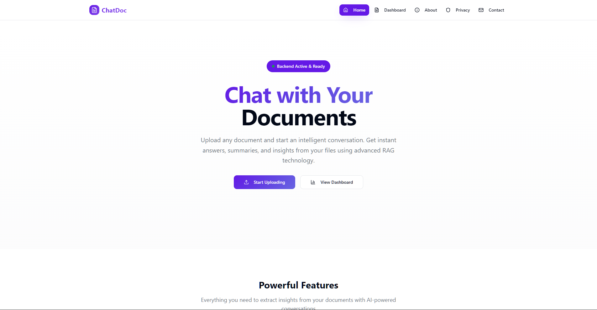
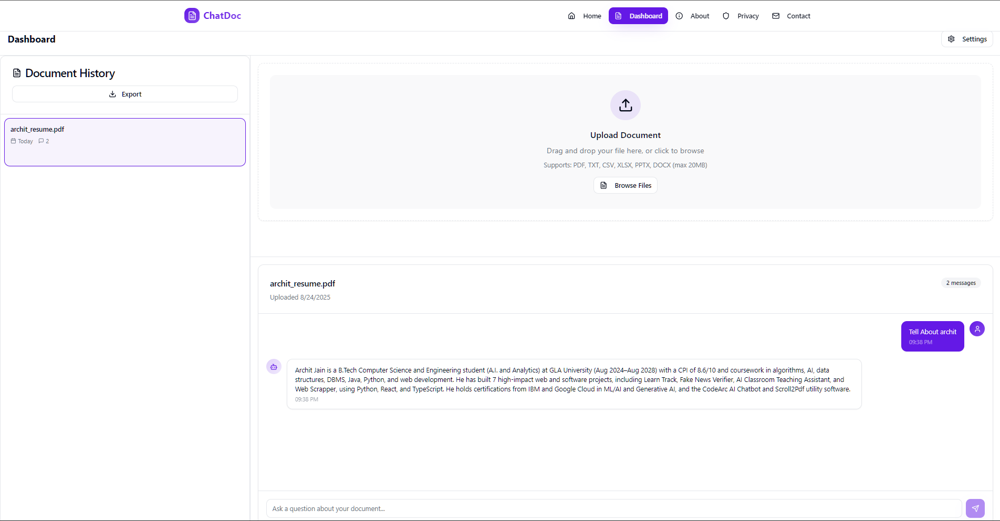
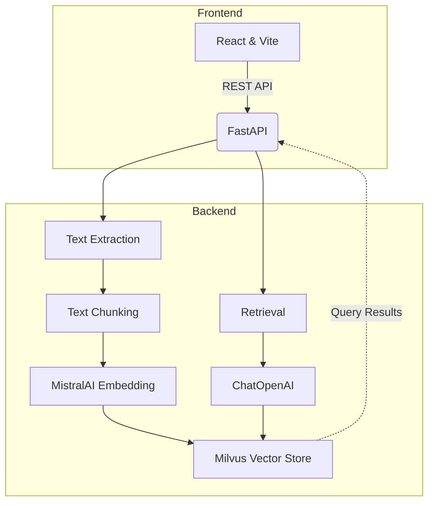

# RAG Projects: ChatDoc + AI/ML/GenAI Mentor Chatbot

   
   


**:icon-mark-github: GitHub:** [0xarchit/ChatDoc](https://github.com/0xarchit/ChatDoc){target="_blank"}  
**:icon-mark-github: GitHub:** [0xarchit/DocumentChat-Simple-Rag-VectorDB-Project](https://github.com/0xarchit/DocumentChat-Simple-Rag-VectorDB-Project){target="_blank"}

## Page Contents

- :icon-book: [ChatDoc](#chatdoc)
  - [Overview](#overview)
  - [Preview](#preview)
  - [Architecture](#architecture)
  - [Features](#features)
  - [Tech Stack](#tech-stack)
  - [Getting Started](#getting-started)
  - [API Reference](#api-reference)
  - [Future Goals](#future-goals)
- :icon-Hubot: [AI/ML/GenAI Mentor Chatbot](#ai-ml-genai-mentor-chatbot)
  - [Running in Google Colab](#running-in-google-colab)
  - [Preview](#preview)
  - [Basic Working](#basic-working)
  - [Usage](#usage)
  - [Clearing Data](#clearing-data)


# ChatDoc
**:icon-mark-github: GitHub:** [0xarchit/ChatDoc](https://github.com/0xarchit/ChatDoc){target="_blank"}  
**:icon-globe: Live Demo:** [https://chatdoc.0xarchit.is-a.dev](https://chatdoc.0xarchit.is-a.dev){target="_blank"} 

 [](https://github.com/0xarchit/chatdoc/stargazers) 

> A unified retrieval-augmented generation (RAG) document API and web interface, powered by FastAPI, React, Vite, Milvus, and MistralAI.

## Overview
ChatDoc is a web application enabling users to upload documents, extract and chunk text, store embeddings in Milvus, and query with state-of-the-art LLMs. It provides both a REST API and a web-based interface for seamless integration.

## Preview
  


## Architecture


## Features
- :icon-upload: Upload PDF, TXT, CSV, XLSX, PPTX, DOCX files via API or web form
- :icon-file: Automatic text extraction and chunking (500 tokens, 50 overlap)
- :icon-cpu: Embedding with MistralAI Embeddings & storage in Milvus (Zilliz)
- :icon-hubot: Retrieval and response generation via OpenAI-compatible LLM
- :icon-device-desktop: Real-time, responsive React UI with upload, history, and settings
- :icon-gear: Per-request overrides for API keys, endpoints, and collections
- :icon-shield-lock: Admin endpoints for deleting uploads or clearing the vector store

## Tech Stack
- **Backend**: FastAPI, Python, PyPDF2, python-pptx, python-docx, Pandas, Milvus
- **Frontend**: React, Vite, TypeScript, Tailwind CSS
- **Embeddings**: MistralAI
- **Vector Database**: Milvus (Zilliz Cloud)
- **LLM**: OpenAI-compatible ChatOpenAI via LangChain

## Getting Started

### Prerequisites
- Node.js >= 16 and npm/yarn
- Python >= 3.9
- Docker (optional)
- Milvus or Zilliz Cloud credentials
- MistralAI & OpenAI API keys

### Backend Setup
```powershell
cd Backend
copy .env.example .env
# Edit .env and set:
# MISTRAL_API_KEY, ZILLIZ_URI, ZILLIZ_TOKEN, HF_TOKEN (optional), COLLECTION_NAME
pip install -r requirements.txt
uvicorn main:app --reload
```

### Frontend Setup
```powershell
cd Frontend
npm install
npm run dev
```

### Docker (Optional)
```powershell
# Build and run backend container
docker build -t chatdocapi-backend .
docker run --rm -p 8080:8080 \
  -e MISTRAL_API_KEY=$env:MISTRAL_API_KEY \
  -e ZILLIZ_URI=$env:ZILLIZ_URI \
  -e ZILLIZ_TOKEN=$env:ZILLIZ_TOKEN \
  -e ZILLIZ_COLLECTION_NAME=$env:ZILLIZ_COLLECTION_NAME \
  chatdocapi-backend
```

## API Reference

### 1) POST /upload
- **Description**: Upload document and store embeddings.
- **Content-Type**: multipart/form-data
- **Fields**:
  - `file` (required)
  - `mistral_api_key`, `zilliz_uri`, `zilliz_token`, `collection_name` (optional)
- **Responses**:
  - `200`: `{ "upload_id": "<uuid>" }`
  - `400`: errors (no file, extraction failure)
  - `413`: file too large

### 2) POST /query
- **Description**: Retrieve and answer based on stored chunks.
- **Content-Type**: application/json
- **Body**:
  ```json
  {
    "question": "string",
    "upload_id": "string",
    ...overrides
  }
  ```
- **Responses**:
  - `200`: `{ "answer": "<generated answer>" }`
  - `400`: invalid body
  - `500`: generation error

### 3) DELETE /delete/{upload_id}
- **Description**: Remove all vectors for a given upload.
- **Params**: `upload_id` path, overrides as query params
- **Response**: `{ "status": "deleted" }`

### 4) GET /deleteall
- **Description**: Clear entire vector store.
- **Query**: `password` (native admin) or per-request overrides
- **Response**: `{ "status": "all_deleted" }`

## Future Goals
- Streaming responses from the model to improve perceived latency and UX.
- Better OCR and robust file parsing for scanned PDFs and more file formats.
- Pluggable support for multiple vector stores (Milvus, FAISS, Pinecone, etc.).
- Increase upload and context limits (larger files, fewer artificial word/chunk restrictions).
- Personalization with login/signup, per-user profiles, metadata, and tags.
- Expand supported AI models/providers and allow per-request model selection.


# AI/ML/GenAI Mentor Chatbot {#ai-ml-genai-mentor-chatbot}

**:icon-mark-github: GitHub:** [0xarchit/DocumentChat-Simple-Rag-VectorDB-Project](https://github.com/0xarchit/DocumentChat-Simple-Rag-VectorDB-Project){target="_blank"} 

This vibe coded project provides an AI/ML/GenAI Mentor Chatbot built with Gradio, LangChain, ChromaDB, and Google Gemini. You can run the notebook in Google Colab to interact with the chatbot.

## Running in Google Colab

1. Open the notebook:
   - Import the notebook into your Google Drive or GitHub repository.
   - Open Google Colab and select **File > Open notebook**.
   - Under the **Google Drive**, **GitHub**, or **Upload** tab, locate your notebook (`main.ipynb`) and open it.

2. Install dependencies:
   - Colab will automatically install required packages when running the first cell.

3. Run all cells:
   - In Google Colab, select **Runtime > Run all** to execute every cell sequentially.
   - This will set up the environment, process documents, initialize the chatbot, and launch the Gradio interface.

Alternatively, you can use the public Colab link:

[Open in Google Colab](https://colab.research.google.com/drive/1ARotfMTrLOnZEVhAkys69O5NuknUWrNJ?usp=sharing){target="_blank"}

> [!NOTE]
> :icon-key: Also add your Gemini API key in Colab Secrets before running.

## Preview


## Basic Working

This project combines several modern AI tools to create an interactive mentor chatbot:

- **Gradio UI**: Provides a simple, user-friendly web interface for uploading documents and chatting with the AI mentor.
- **ChromaDB (Vector Database)**: Stores document chunks as vector embeddings, enabling fast and relevant retrieval of information based on your questions.
- **all-MiniLM-L6-v2 Embedding Model**: Converts text from your documents and queries into numerical vectors, allowing semantic search and matching.
- **Google Gemini (Generative AI)**: Generates detailed, structured answers using both retrieved document context and its own AI/ML/GenAI knowledge.

**How it works:**
1. Upload your PDF, PPT, or TXT files using the Gradio interface.
2. The files are split into chunks and embedded using the all-MiniLM-L6-v2 model.
3. ChromaDB stores these embeddings for efficient retrieval.
4. When you ask a question, the system finds the most relevant document chunks and sends them, along with your question, to Gemini.
5. Gemini generates a comprehensive answer, referencing your materials and providing real-world examples.

## Usage

- Upload your PDF, PPT, or TXT files using the notebook’s upload section.
- After processing, ask questions about AI, ML, or GenAI topics.
- The chatbot will provide structured, detailed responses with real-world examples based on provided material only.

## Clearing Data

- To clear all uploaded documents and chat history, run the **Clear All Data** button in the interface.
