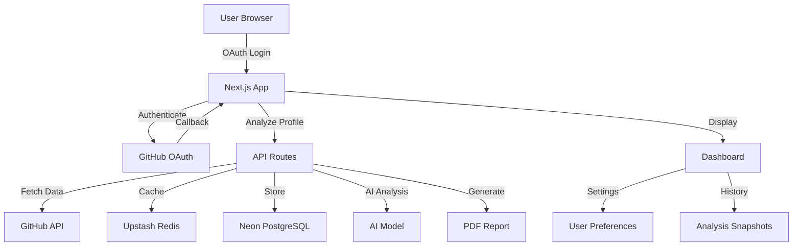

# GitHub Profile Analyzer

      
   [](https://github.0xarchit.is-a.dev){target="_blank"}

:icon-mark-github: **GitHub:** [0xarchit/github-profile-analyzer](https://github.com/0xarchit/github-profile-analyzer){target="_blank"}  
:icon-globe: **Live Demo:** [https://github.0xarchit.is-a.dev](https://github.0xarchit.is-a.dev){target="_blank"}

> [!TIP]
> Comprehensive GitHub profile analysis tool with AI-powered scoring, real-time metrics, and exportable reports.

## :icon-tools: Features

### Profile Analysis
- :icon-hubot: **AI-Driven Evaluation**: Detailed scoring and developer type classification
- :icon-code: **Language Detection**: Proficiency analysis across your repositories
- :icon-repo: **Repository Analysis**: Contribution metrics and project insights

### Authentication & Security
- :icon-key: **GitHub OAuth 2.0**: Secure authentication flow
- :icon-shield: **JWT Sessions**: Token-based session management with jose
- :icon-lock: **AES-256-GCM Encryption**: Protects sensitive data at rest
- :icon-alert: **Rate Limiting**: Upstash Rate Limit for abuse prevention
- :icon-shield: **Security**: SQL injection and XSS protection

### Data & Export
- :icon-calendar: **Contribution Calendar**: Real-time parsing and streak calculation
- :icon-file: **PDF Reports**: Generate exportable reports with profile snapshots
- :icon-database: **Encrypted Storage**: Secure analysis history and snapshots

### Performance
- :icon-zap: **Redis Caching**: Upstash Redis for response caching
- :icon-graph: **Optimized Queries**: Efficient Neon PostgreSQL operations
- :icon-sync: **Concurrent Handling**: Built for high-throughput with Bun runtime

### User Experience
- :icon-star: **Star Verification**: Access control through repository stars
- :icon-person: **Guest Sessions**: Limited access without authentication
- :icon-gear: **User Settings**: Personalized preferences
- :icon-device-desktop: **Responsive UI**: Tailwind CSS with dark mode support

## :icon-stack: System Architecture



## :icon-gear: Tech Stack

| Category | Technologies |
|----------|-------------|
| **Framework** | Next.js 16 with React 19 |
| **Language** | TypeScript |
| **Runtime** | Bun |
| **Database** | Neon PostgreSQL |
| **Authentication** | JWT with jose, GitHub OAuth 2.0 |
| **Caching** | Upstash Redis |
| **Rate Limiting** | Upstash Rate Limit |
| **PDF Generation** | react-pdf |
| **Styling** | Tailwind CSS |
| **Validation** | Zod schemas |

## :icon-play: Getting Started

### Prerequisites

- Bun runtime
- GitHub OAuth application credentials
- Neon PostgreSQL database
- Upstash Redis instance

### Installation

```bash
git clone https://github.com/0xarchit/github-profile-analyzer.git
cd github-profile-analyzer
bun install
```

### Environment Variables

Create a `.env.local` file:

```env
GITHUB_TOKENS=
NEXT_PUBLIC_APP_URL=
GITHUB_PAT_TOKENS=
GITHUB_MODEL=
DATABASE_WRITE=
DATABASE_READ=
GITHUB_CLIENT_ID=
GITHUB_CLIENT_SECRET=
JWT_SECRET=
UPSTASH_TOKEN=
UPSTASH_URL=
ENCRYPTION_SECRET=
```

### Development

```bash
bun run dev
```

Server runs on http://localhost:3000

### Production Build

```bash
bun run build
bun run start
```

## :icon-diff: API Routes

| Method | Endpoint | Description |
|--------|----------|-------------|
| `POST` | `/api/analyze` | Analyze GitHub profile |
| `GET` | `/api/contributions` | Fetch contribution data |
| `GET` | `/api/star-status` | Verify star status |
| `GET` | `/api/scans/[id]` | Retrieve scan results |
| `POST` | `/api/auth/github` | Initiate GitHub OAuth |
| `GET` | `/api/auth/github/callback` | OAuth callback handler |
| `GET` | `/api/auth/me` | Get current user |
| `POST` | `/api/auth/logout` | Logout user |
| `GET` | `/api/users/settings` | Fetch user settings |
| `POST` | `/api/users/settings` | Update user settings |

## :icon-file-directory: Project Structure

```
src/
├── app/                 # Next.js app router
│   ├── api/            # API route handlers
│   ├── auth/           # Authentication pages
│   └── dashboard/      # User dashboard
├── components/          # React components
│   ├── ui/             # Reusable UI elements
│   └── features/       # Feature-specific components
├── lib/                 # Utilities and helpers
│   ├── auth.ts         # Authentication utilities
│   ├── db.ts           # Database connection
│   └── cache.ts        # Redis caching
└── types/               # TypeScript type definitions
```

## :icon-pencil: Contributing

Contributions are welcome! Please follow these steps:

1. Fork the repository
2. Create a feature branch (`git checkout -b feature/amazing-feature`)
3. Commit your changes (`git commit -m 'Add some amazing feature'`)
4. Push to the branch (`git push origin feature/amazing-feature`)
5. Open a Pull Request

## :icon-shield: Security

The project implements:

- AES-256-GCM encryption for sensitive data
- Rate limiting and abuse prevention
- SQL injection and XSS protection
- JWT-based session management
