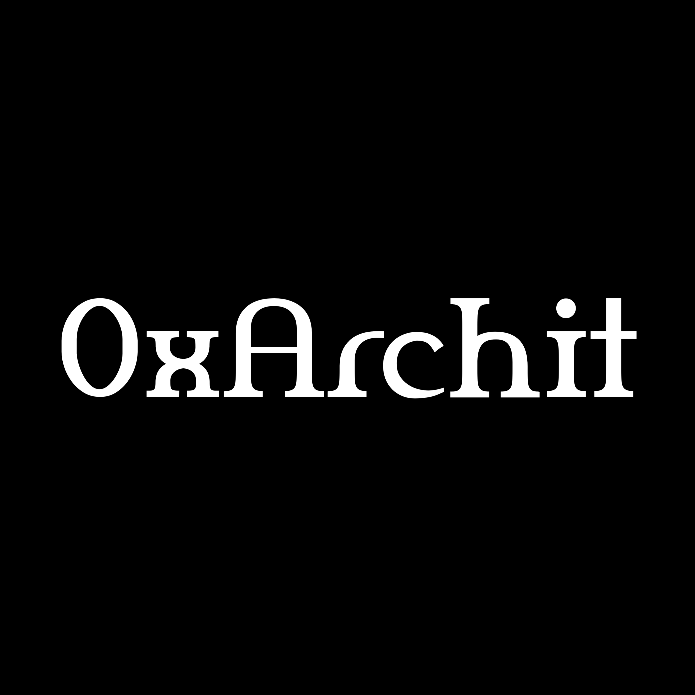

# Welcome to 0xArchit Documentation

{width="120" align="right"}

> [!NOTE] 
> This documentation site is built with Retype and features full-text search, dark/light modes, and collaborative editing.

## 👋 Hello There!

This website hosts comprehensive documentation for my projects and technical work. 

I've created this space to share knowledge, specifications, and insights from my development journey.

---

## :icon-rocket: Featured Projects

||| :icon-shield-check: [Fake News Detector](FakeNews.md)
An AI-powered web application that verifies the authenticity of news articles, providing trust scores and analysis.
|||
||| :icon-mortar-board: [Learn Track](LearnTrack.md)
LearnTrack is a React/TypeScript and FastAPI–based learning management system offering role‑based access, course and assignment management, file uploads, real‑time notifications, and analytics.
|||

---

## :icon-person: About Me

I'm [**Archit Jain** (0xArchit)](https://0xarchit.is-a.dev), a programmer and student in India passionate about building innovative solutions.

### :icon-star: Skills & Interests

+++ :icon-code: Technical Skills
- MERN Stack Development
- Python and AI Implementation
- Cyber Security & Ethical Hacking
- Open-Source Development
+++ :icon-mortar-board: Learning Journey
As a self-taught programmer, I've learned most things through reverse engineering and online resources.
+++ :icon-heart: Personal Interests
When not coding, I enjoy gaming, reading tech news, and following business and crypto markets.
+++

---

## :icon-link: Connect With Me

- GitHub: [0xarchit](https://github.com/0xarchit)
- LinkedIn: [0xarchit](https://www.linkedin.com/in/0xarchit/)
- Twitter: [0xarchit](https://x.com/0xarchit)
- Email: [mail@0xarchit.is-a.dev](mailto:mail@0xarchit.is-a.dev)

---

## :icon-book: What You'll Find Here

- **Project Documentation**: 
  Detailed guides for projects I'm working on

- **Technical Specifications**: 
  Architecture diagrams, API references, and implementation details

- **Tutorials**: 
  Step-by-step guides for using my tools and applications

- **Research Findings**: 
  Results and insights from my technical explorations

---

## :icon-search: Navigation

Use the sidebar to browse through different project categories. 

Each section contains comprehensive documentation to help you understand the purpose, implementation, and usage of my projects.

## :icon-bell: Stay Updated

!!!
I regularly update this documentation as my projects evolve. 

Bookmark this site to stay updated with the latest information.
!!!

Thanks for visiting my documentation hub!