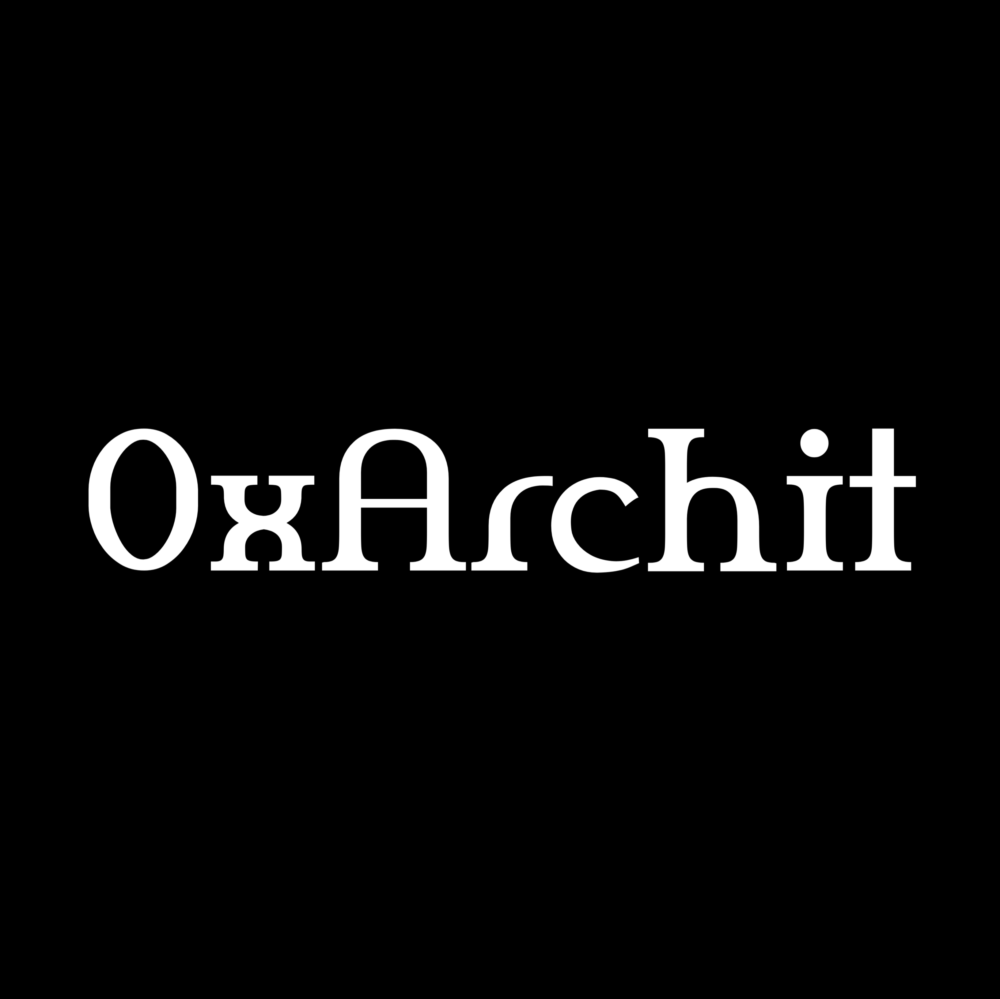

# :icon-home: Welcome to 0xArchit Documentation

     
   {target="_blank"}

:icon-mark-github: **GitHub**: [0xarchit/Docs-Hosting](https://github.com/0xarchit/Docs-Hosting){target="_blank"}  
:icon-globe: **Live Demo**: [https://docs.0xarchit.is-a.dev/](https://docs.0xarchit.is-a.dev/){target="_blank"}  

{width="150" align="right"}

> [!NOTE] 
> This documentation site is built with **Retype** and features full-text search, dark/light modes, and collaborative editing.

**Hello There!**  
This website hosts comprehensive documentation for my projects and technical work. I've created this space to share knowledge, specifications, and insights from my development journey.

---

## :icon-book: About This Documentation Hub

This documentation hub serves as a central repository for technical specifications, architecture details, and usage guides for all my open-source projects. Each project page contains:

- :icon-file-directory: **Complete Project Overview** - Problem statements, solutions, and key features
- :icon-stack: **Architecture Diagrams** - System design and data flow visualizations  
- :icon-tools: **Tech Stack Details** - Frameworks, libraries, and tools used
- :icon-play: **Installation & Setup** - Step-by-step guides for local development
- :icon-terminal: **API Reference** - Comprehensive endpoint documentation
- :icon-package: **Configuration** - Environment variables and deployment instructions
- :icon-rocket: **Usage Examples** - Practical examples and workflows
- :icon-bug: **Troubleshooting** - Common issues and solutions

Navigate through the project documentation using the sidebar or search bar to explore each project in depth.

---

## :icon-person: About Me

I'm [**Archit Jain** (0xArchit)](https://0xarchit.is-a.dev), a passionate programmer and student from India. I specialize in building innovative web applications, automation tools, and exploring the intersection of AI and software development.

### :icon-link: Connect With Me

:::buttons
[GitHub :icon-mark-github:](https://github.com/0xarchit){target="_blank"}  
[LinkedIn :icon-briefcase:](https://www.linkedin.com/in/0xarchit/){target="_blank"}  
[Twitter :icon-mention:](https://x.com/0xarchit){target="_blank"}  
[Email :icon-mail:](mailto:mail@0xarchit.is-a.dev){target="_blank"}  
:::

---

## :icon-bell: Stay Updated

!!!
I regularly update this documentation as my projects evolve.  
Bookmark this site to stay updated with the latest research and tools.
!!!

Thanks for visiting my documentation hub!
