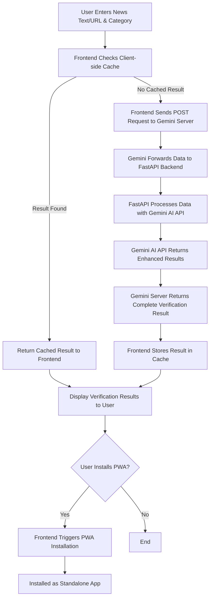

```mermaid
flowchart TD
    A[User Enters News Text/URL & Category] --> B[Frontend Checks Client-side Cache]
    B -->|Result Found| C[Return Cached Result to Frontend]
    C --> D[Display Verification Results to User]
    B -->|No Cached Result| E[Frontend Sends POST Request to Gemini Server]
    E --> F[Gemini Forwards Data to FastAPI Backend]
    F --> G[FastAPI Processes Data with Gemini AI API]
    G --> H[Gemini AI API Returns Enhanced Results]
    H --> I[Gemini Server Returns Complete Verification Result]
    I --> J[Frontend Stores Result in Cache]
    J --> D    
    D --> K{User Installs PWA?}
    K -->|Yes| L[Frontend Triggers PWA Installation]
    L --> M[Installed as Standalone App]
    K -->|No| N[End]
```